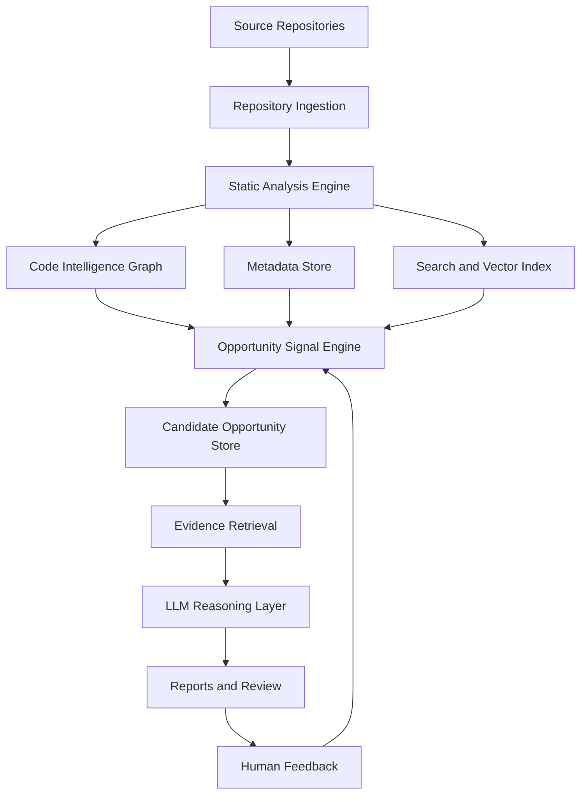

# IdeaMiner

**Evidence-backed AI and automation opportunity mining for banking codebases**

IdeaMiner is a code intelligence tool for discovering practical AI, ML, and workflow automation opportunities across enterprise Java/Spring Boot repositories.

The key idea is simple: source code is the most reliable record of how business workflows actually run. IdeaMiner parses that code, builds structured evidence, detects opportunity signals, retrieves supporting implementation details, and uses an LLM to produce explainable opportunity cards.

The LLM is not the source of truth. It is used as an analyst over evidence produced by static analysis, graph relationships, search, and scoring.

## What Problem It Solves

Banking organizations often have important customer workflows spread across controllers, services, batch jobs, repositories, message listeners, external integrations, and database tables. Manually reviewing all of that code to find modernization opportunities is slow and incomplete.

IdeaMiner helps answer questions like:

- Which customer-facing flows are delayed by overnight batch processing?
- Where are high-value decisions implemented as hardcoded rules?
- Which manual review workflows could be automated?
- Which operational failures could be detected earlier with anomaly detection?
- Which recommendations are actually supported by code evidence?

## Architecture



## Design Principles

- **Evidence first:** Every recommendation should cite concrete code evidence.
- **LLM as analyst, not oracle:** The model validates and explains candidates instead of inventing unsupported ideas.
- **Code intelligence over raw text:** Endpoints, methods, calls, tables, jobs, annotations, and domain terms matter.
- **Opportunity signals before prompts:** Deterministic detectors create candidates before LLM reasoning.
- **AI is optional:** Some opportunities should recommend automation, real-time processing, or better workflow design instead of ML.
- **Security aware:** Source code sent to external services must be configurable, auditable, and redacted.

## Core Components

### Repository Ingestion

Tracks local filesystem repositories, source files, content hashes, and indexing timestamps. If a local directory is Git-backed, IdeaMiner also records branch, remote URL, and commit SHA. Repeated indexing should upsert changed facts rather than duplicating records.

### Static Analysis Engine

For Java/Spring Boot code, the analyzer should extract:

- classes, methods, signatures, and annotations
- controllers and HTTP endpoints
- services, repositories, entities, and components
- scheduled jobs and batch jobs
- message consumers and external integrations
- database table access
- method calls and dependency relationships
- complexity and rule-heavy decisioning signals
- domain terms from code names, constants, comments, and annotations

### Code Intelligence Graph

Represents workflows and relationships across repositories.

Example relationships:

- endpoint exposes controller method
- controller calls service
- service reads or writes table
- service calls external system
- scheduled job updates customer-visible status
- candidate opportunity is supported by specific evidence

### Search and Vector Index

IdeaMiner uses structured search, keyword search, and semantic vector search.

Vector chunks should be method-level or logical-block-level. Whole-class embeddings are useful only as summaries because large enterprise classes often dilute or truncate the useful signal.

### Opportunity Signal Engine

Signal detectors create evidence-backed candidates before LLM reasoning.

Initial detectors:

- rule-heavy decisioning
- batch-to-real-time conversion
- manual review workflows
- customer friction and delayed status updates
- repeated validations
- retry-heavy or exception-heavy integrations
- reconciliation and anomaly detection
- static offer, product, or message selection

### LLM Reasoning Layer

The LLM receives one candidate at a time with structured evidence. It validates whether the opportunity is plausible, identifies missing evidence, scores suitability, and writes the final opportunity card.

### Review and Feedback

Architects and product leaders can mark candidates as accepted, rejected, duplicate, already planned, not customer-impacting, or needing more evidence. Feedback improves future ranking.

## Opportunity Card Format

Each recommendation should include:

- opportunity title
- customer benefit
- current state with code references
- proposed AI/ML or automation solution
- evidence strength
- confidence score
- AI suitability
- automation suitability
- data dependencies
- risks and compliance considerations
- implementation complexity
- recommended next step

## Example Opportunity

```text
Opportunity: Convert nightly dispute status updates to near-real-time workflow automation

Customer Benefit:
Customers receive faster dispute updates instead of waiting for overnight batch processing.

Current State:
- DisputeBatchJob updates dispute status on a schedule.
- CustomerNotificationService sends notifications after status updates.
- DisputeEligibilityService contains rule-heavy branching.

Proposed Solution:
Move status changes to an event-driven workflow. Use AI for exception summarization only where evidence supports it.

Suitability:
Automation: High
AI/ML: Medium
Confidence: 0.82
```

## Current Project Status

The current codebase is an early Java/Spring Boot CLI prototype. It already demonstrates:

- PostgreSQL-backed repository and source-file metadata storage
- local filesystem repository registration
- optional Git metadata enrichment for Git-backed local directories
- production `.java` source-file discovery and content-hash change detection
- Java source parsing with JavaParser
- local embeddings using LangChain4j
- vector-backed evidence retrieval
- OpenAI-backed report generation
- Gradle-based build

The target architecture is documented in [docs/implementation_plan.md](docs/implementation_plan.md). The current implementation should evolve toward an evidence-first pipeline with stable IDs, method-level chunks, signal detectors, workspace-scoped analysis, and structured LLM outputs.

## Prerequisites

- Java 17 or newer
- Gradle wrapper included in the repository
- local PostgreSQL with pgvector enabled
- OpenAI API key if using the OpenAI LLM path

## Build

```bash
./gradlew clean build
```

## Current CLI Usage

Verify the local database and pgvector setup:

```bash
java -jar build/libs/ideaminer-0.0.1-SNAPSHOT.jar health
```

Register a local repository directory:

```bash
java -jar build/libs/ideaminer-0.0.1-SNAPSHOT.jar register /path/to/repo
```

List registered repositories:

```bash
java -jar build/libs/ideaminer-0.0.1-SNAPSHOT.jar repos
```

Discover production Java source files and detect changes:

```bash
java -jar build/libs/ideaminer-0.0.1-SNAPSHOT.jar scan-files /path/to/repo
```

Parse active Java source files and store class-level facts:

```bash
java -jar build/libs/ideaminer-0.0.1-SNAPSHOT.jar index-classes /path/to/repo
```

List indexed class facts:

```bash
java -jar build/libs/ideaminer-0.0.1-SNAPSHOT.jar classes /path/to/repo
```

Parse active Java source files and store method-level facts:

```bash
java -jar build/libs/ideaminer-0.0.1-SNAPSHOT.jar index-methods /path/to/repo
```

List indexed methods, optionally filtering by complexity:

```bash
java -jar build/libs/ideaminer-0.0.1-SNAPSHOT.jar methods /path/to/repo --complexity-min 5
```

Run the deterministic evidence-first pipeline:

```bash
java -jar build/libs/ideaminer-0.0.1-SNAPSHOT.jar endpoints /path/to/repo
java -jar build/libs/ideaminer-0.0.1-SNAPSHOT.jar jobs /path/to/repo
java -jar build/libs/ideaminer-0.0.1-SNAPSHOT.jar db-access /path/to/repo
java -jar build/libs/ideaminer-0.0.1-SNAPSHOT.jar graph /path/to/repo --from endpoint:/api/loans/customerId/eligibility
java -jar build/libs/ideaminer-0.0.1-SNAPSHOT.jar search-domain /path/to/repo loan
java -jar build/libs/ideaminer-0.0.1-SNAPSHOT.jar detect all /path/to/repo
java -jar build/libs/ideaminer-0.0.1-SNAPSHOT.jar candidates /path/to/repo
java -jar build/libs/ideaminer-0.0.1-SNAPSHOT.jar evidence <candidate-id> --semantic --prompt-safe
java -jar build/libs/ideaminer-0.0.1-SNAPSHOT.jar report /path/to/repo --no-llm
```

Optional enrichment and review commands:

```bash
java -jar build/libs/ideaminer-0.0.1-SNAPSHOT.jar chunks /path/to/repo
java -jar build/libs/ideaminer-0.0.1-SNAPSHOT.jar embed /path/to/repo
java -jar build/libs/ideaminer-0.0.1-SNAPSHOT.jar semantic-search /path/to/repo "loan eligibility rules"
java -jar build/libs/ideaminer-0.0.1-SNAPSHOT.jar validate <candidate-id>
java -jar build/libs/ideaminer-0.0.1-SNAPSHOT.jar workspace create lending
java -jar build/libs/ideaminer-0.0.1-SNAPSHOT.jar workspace add lending /path/to/repo
java -jar build/libs/ideaminer-0.0.1-SNAPSHOT.jar feedback <candidate-id> accepted --notes "Good modernization candidate"
```

Try the included banking fixture:

```bash
java -jar build/libs/ideaminer-0.0.1-SNAPSHOT.jar register fixtures/banking-sample
java -jar build/libs/ideaminer-0.0.1-SNAPSHOT.jar detect all fixtures/banking-sample
java -jar build/libs/ideaminer-0.0.1-SNAPSHOT.jar report fixtures/banking-sample --no-llm
```

Run the older parser/vector indexing path:

```bash
java -jar build/libs/ideaminer-0.0.1-SNAPSHOT.jar index /path/to/repo
```

Run analysis over indexed code:

```bash
java -jar build/libs/ideaminer-0.0.1-SNAPSHOT.jar analyze
```

## Configuration

Configuration lives in `src/main/resources/application.properties`.

Important settings:

```properties
spring.datasource.url=${IDEAMINER_DB_URL:jdbc:postgresql://localhost:5432/ideaminer}
spring.datasource.username=${IDEAMINER_DB_USERNAME:ideaminer}
spring.datasource.password=${IDEAMINER_DB_PASSWORD:ideaminer}
spring.datasource.driver-class-name=org.postgresql.Driver
langchain4j.open-ai.chat-model.api-key=${OPENAI_API_KEY:demo}
langchain4j.open-ai.chat-model.model-name=gpt-4o
```

Local PostgreSQL setup is documented in [docs/local_postgres_setup.md](docs/local_postgres_setup.md).

## Roadmap

### Phase 1: Evidence-First MVP

- stable source-derived IDs
- repository and source file tables
- method-level metadata and chunks
- endpoint and annotation extraction
- upsert-based indexing
- initial opportunity signal detectors
- evidence-backed Markdown reports

### Phase 2: Workflow Intelligence

- method call graph
- endpoint-to-service-to-table tracing
- scheduled job and batch detection
- message listener detection
- per-candidate retrieval
- structured LLM JSON output
- scoring model

### Phase 3: Enterprise Readiness

- virtual workspaces
- reviewer feedback loop
- approved LLM provider configuration
- secret redaction
- metadata-only mode
- scalable vector and search backend

## Documentation

- [Product Requirements Document](docs/prd.md)
- [Implementation Plan](docs/implementation_plan.md)
- [Architecture Walkthrough](docs/walkthrough.md)

## License

MIT License
