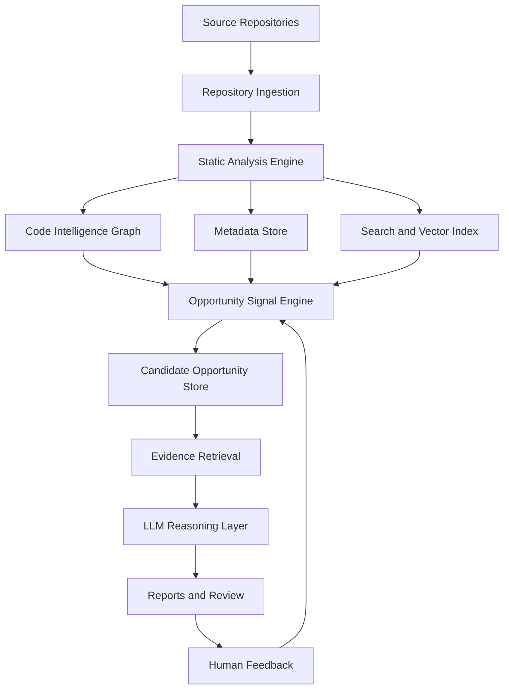

# IdeaMiner Implementation Plan

IdeaMiner should be implemented as a code intelligence and opportunity mining system, not as a generic chatbot over source code.

The core architecture is:

1. Ingest repositories.
2. Extract structured code facts.
3. Build a code intelligence graph.
4. Store searchable text and vector evidence.
5. Detect opportunity candidates with deterministic signal rules.
6. Retrieve evidence for each candidate.
7. Use an LLM to validate, explain, score, and report.
8. Capture human feedback to improve future ranking.

Important implementation rule: repository scanning and static analysis should not require an LLM. The indexing pipeline must be deterministic, repeatable, testable, and safe to run on sensitive code. LLM usage belongs later in the flow, after the system has already generated evidence-backed opportunity candidates.

## 1. Target Architecture



Repository onboarding and indexing are repository-scoped. Workspace analysis is a logical aggregation over already indexed repositories and must not require re-scanning unchanged repositories.

## 2. Recommended Technology Stack

### Initial Implementation

- **Language:** Java 17
- **Application framework:** Spring Boot CLI
- **Build:** Gradle wrapper
- **Java parsing:** JavaParser
- **Primary database:** PostgreSQL
- **Vector store:** pgvector inside PostgreSQL
- **Graph store:** relational edge tables inside PostgreSQL
- **LLM orchestration:** LangChain4j, used only after candidate generation
- **Embedding model:** optional during early MVP; add local or approved embedding model for method/code chunks
- **Report format:** Markdown first, PDF later

### Production Direction

- **Primary database:** PostgreSQL
- **Vector search:** pgvector or Qdrant
- **Graph:** relational graph tables first; Neo4j only if graph traversal becomes a bottleneck
- **Search:** OpenSearch if keyword/code search needs to scale
- **LLM:** approved enterprise OpenAI/Azure OpenAI/local model, configurable by environment

### Recommended Starting Stack

Start with one deployable application and one database:

- Spring Boot application
- PostgreSQL with the pgvector extension
- local filesystem workspace for repositories, reports, caches, and model files
- configurable LLM provider for later reasoning/report generation

Avoid adding Qdrant, Neo4j, OpenSearch, or multiple services in the first implementation unless scale proves they are needed.

## 3. Resource and Dependency Plan

### 3.1 Required Runtime Resources

The minimum serious implementation needs:

- Java 17 or Java 21
- Gradle wrapper
- Git CLI only for optional metadata enrichment when a local repository is Git-backed
- PostgreSQL
- pgvector PostgreSQL extension
- filesystem workspace for cloned repositories and generated artifacts
- LLM API credentials only for the reasoning/reporting phase

### 3.2 Database Choice

Use PostgreSQL as the primary system of record.

PostgreSQL should store:

- repository metadata
- file metadata
- parsed code facts
- graph edges
- code chunks
- vector embeddings through pgvector
- opportunity candidates
- evidence records
- generated reports
- reviewer feedback

This keeps the first implementation operationally simple. PostgreSQL can handle relational queries, JSON metadata, full-text search, graph-like edge tables, and vector search through pgvector.

### 3.3 Vector Search Choice

Use pgvector first.

Do not introduce a separate vector database until there is a real scaling reason. Move to Qdrant later only if:

- vector search latency becomes a problem
- the number of code chunks grows very large
- advanced vector filtering is needed
- vector infrastructure needs to scale independently from the metadata database

### 3.4 Graph Storage Choice

Use relational graph edge tables first.

Do not introduce Neo4j at the beginning. A `code_edges` table is enough for early workflow reconstruction:

- endpoint to controller
- controller to service
- service to repository
- method to database table
- scheduled job to method
- candidate to supporting evidence

Add Neo4j later only if multi-hop graph exploration becomes central to the product and relational queries become hard to maintain.

### 3.5 LLM Usage

The LLM is not required during repository scanning.

Do not use the LLM for:

- walking repositories
- parsing source files
- extracting classes/methods/endpoints
- creating graph edges
- calculating complexity
- detecting basic domain terms
- creating stable IDs
- deciding whether files changed

Use the LLM later for:

- validating one opportunity candidate at a time
- explaining customer benefit
- identifying missing evidence
- ranking opportunities
- generating structured JSON
- rendering Markdown report content

This separation keeps scanning deterministic, reduces cost, improves privacy, and makes tests reliable.

### 3.6 Embeddings Usage

Embeddings are optional for the first scanner-only milestone.

Recommended rollout:

1. Build scanner, metadata tables, graph edges, and deterministic signal detectors without embeddings.
2. Add method-level code chunks.
3. Add embeddings for semantic evidence retrieval.
4. Add vector search to enrich per-candidate evidence packages.

When embeddings are added, prefer local or enterprise-approved embedding models if source code privacy matters. External embedding APIs should be configurable and auditable.

### 3.7 Filesystem Dependencies

Use a dedicated workspace directory:

```text
.ideaminer/
  repos/      cloned or linked source repositories
  reports/    generated Markdown or PDF reports
  cache/      parser cache, temporary indexing state, downloaded metadata
  models/     local embedding model files
  logs/       ingestion and analysis logs
```

For a local MVP, this can live under the project directory or a configured user directory.

For a shared deployment, move durable artifacts to managed object storage such as S3, Azure Blob Storage, GCS, or MinIO. Keep PostgreSQL as the source of truth for metadata and references.

### 3.8 Local Development Dependencies

Recommended local development setup:

- locally installed or managed PostgreSQL with pgvector enabled
- Flyway or Liquibase for schema migrations
- integration tests that use a configured local test database
- `.env` file or environment variables for LLM credentials
- local `.ideaminer/` workspace ignored by Git

### 3.9 Deferred Infrastructure

Do not add these in the first implementation:

- Neo4j
- Qdrant
- OpenSearch
- Kubernetes
- multiple microservices
- runtime tracing integrations
- autonomous code modification

These are valid future additions, but they should follow working evidence-first discovery.

## 4. Data Model

### 4.1 Repository Tables

Track source identity and indexing state.

- `repositories`
  - `id`
  - `name`
  - `remote_url`
  - `branch`
  - `commit_sha`
  - `indexed_at`

- `source_files`
  - `id`
  - `repository_id`
  - `path`
  - `language`
  - `content_hash`
  - `last_indexed_at`

### 4.2 Code Fact Tables

- `classes`
  - repository, file, package, class name, type, annotations, complexity

- `methods`
  - class, method name, signature, return type, parameters, annotations, complexity, source span

- `endpoints`
  - HTTP method, route, controller method, request/response types

- `database_access`
  - method/class, table/entity, operation type, query text if available

- `external_integrations`
  - client class, target system, protocol, called methods

- `scheduled_jobs`
  - job class, schedule annotation/expression, method, frequency if known

- `message_consumers`
  - topic/queue, listener method, payload type

### 4.3 Graph Edge Tables

Represent relationships as rows so the first version can stay relational.

- `code_edges`
  - `source_type`
  - `source_id`
  - `edge_type`
  - `target_type`
  - `target_id`
  - `confidence`

Edge types:

- `CONTAINS`
- `CALLS`
- `EXPOSES_ENDPOINT`
- `READS_TABLE`
- `WRITES_TABLE`
- `DEPENDS_ON`
- `SCHEDULED_BY`
- `CONSUMES_MESSAGE`
- `PRODUCES_MESSAGE`
- `USES_EXTERNAL_SYSTEM`
- `IMPLEMENTS_WORKFLOW`
- `SUPPORTS_EVIDENCE`

### 4.4 Vector Chunk Tables

- `code_chunks`
  - `id`
  - `repository_id`
  - `file_id`
  - `class_id`
  - `method_id`
  - `chunk_type`
  - `text`
  - `metadata_json`
  - `embedding_id`

Chunk at method or logical-block level. Whole-class chunks are allowed only as summaries.

### 4.5 Opportunity Tables

- `opportunity_candidates`
  - `id`
  - `workspace_id`
  - `detector_name`
  - `title`
  - `hypothesis`
  - `status`
  - `preliminary_score`
  - `created_at`

- `opportunity_evidence`
  - `candidate_id`
  - `evidence_type`
  - `source_reference`
  - `summary`
  - `strength`

- `opportunity_reports`
  - `candidate_id`
  - `llm_json`
  - `markdown`
  - `confidence_score`
  - `created_at`

- `review_feedback`
  - `candidate_id`
  - `reviewer`
  - `decision`
  - `notes`
  - `created_at`

## 5. Repository Ingestion

The ingestion pipeline should:

1. Resolve repository identity from the local filesystem path.
2. Walk source files using a strict `src/main/java/**/*.java` policy.
3. Calculate content hashes.
4. Skip unchanged files.
5. Parse changed files.
6. Upsert facts using stable IDs.
7. Rebuild graph edges for changed files.
8. Rebuild embeddings for changed chunks only if embeddings are enabled.

Stable IDs should be derived from repository, package, class, method signature, and file path. Avoid random UUIDs for source-derived facts.

The ingestion pipeline must not call the reasoning LLM. It should produce facts and graph edges only.

Repository inputs are local filesystem directories. Git metadata such as branch, remote URL, and commit SHA should be captured only when available; it must not be required for registration or indexing.

Initial indexing scope should include only `.java` files under `src/main/java`. Files outside this path, including tests and non-Java artifacts, are ignored for indexing.

## 6. Static Analysis Engine

The Java/Spring analyzer should extract:

- class declarations
- methods and signatures
- annotations
- Spring routes
- scheduled jobs
- batch components
- repository/entity usage
- external clients
- message listeners
- constants and domain terms
- exception handling
- branching and complexity metrics
- method calls where resolvable

Initial complexity can use simple AST counts, but the target should include cognitive complexity signals such as nested branches, boolean condition size, switch cases, loops, catches, and early returns.

## 7. Code Intelligence Graph

The graph should answer questions like:

- Which endpoint starts this customer workflow?
- Which service makes the decision?
- Which tables are read or written?
- Which external systems are involved?
- Is the workflow synchronous, asynchronous, batch, or scheduled?
- Where are manual review states created?
- Which classes form the full path from customer action to final status?

Use relational edge tables first. Add a dedicated graph database only if query complexity justifies it.

For workspace analysis, build a unified logical graph in PostgreSQL by querying repository-scoped facts and edges across all repositories attached to a workspace. Do not require a separate graph database for this stage.

## 8. Search and Vector Retrieval

Use three retrieval modes:

1. **Structured SQL retrieval** for filters and deterministic facts.
2. **Keyword search** for names, comments, constants, query text, and domain terms.
3. **Vector retrieval** for semantic similarity over method-level chunks, once embeddings are enabled.

Do not embed only whole classes. Large enterprise classes will exceed useful context windows and dilute semantic meaning.

Each vector chunk must carry metadata:

- repository
- branch
- commit
- file path
- class
- method
- chunk type
- domain tags
- customer-facing flag if known

For the earliest MVP, structured SQL retrieval plus keyword search is enough. Add vector retrieval after the scanner and signal engine are stable.

## 9. Opportunity Signal Engine

The signal engine should generate candidates before LLM reasoning.

### 9.1 Rule-Heavy Decisioning Detector

Detect methods/classes with:

- high branching complexity
- threshold constants
- score, risk, fraud, eligibility, approval, fee, limit, offer, or pricing terms
- customer-facing or business-critical flow participation

Candidate example:

> This eligibility service appears to implement rule-heavy decisioning and may be a candidate for ML-assisted decision support.

### 9.2 Batch-to-Real-Time Detector

Detect scheduled or batch jobs that:

- update customer-visible statuses
- touch payments, disputes, loans, onboarding, cards, or notifications
- perform reconciliation or delayed fulfillment

Candidate example:

> This nightly dispute status update may be convertible to near-real-time workflow automation.

### 9.3 Manual Review Detector

Detect flows that:

- create cases, tickets, queues, holds, pending states, or manual approvals
- route to operations teams
- delay customer completion

Candidate example:

> This account opening flow appears to route exceptions to manual review and may benefit from document AI or workflow automation.

### 9.4 Customer Friction Detector

Detect customer-facing endpoints with:

- downstream batch dependencies
- repeated validation failures
- retry/error handling around external systems
- delayed notification patterns

### 9.5 Operational Anomaly Detector

Detect:

- reconciliation logic
- compensating transactions
- retry loops
- exception-heavy integrations
- payment/account balance correction flows

### 9.6 Personalization Detector

Detect:

- static offer selection
- hardcoded segmentation
- rule-based messaging
- product recommendation logic

## 10. Candidate Scoring

Each candidate receives preliminary scores before LLM review:

- customer impact
- evidence strength
- workflow centrality
- technical feasibility
- AI/ML suitability
- automation suitability
- data availability
- compliance risk
- implementation complexity

The score should help prioritize, but it should not hide the underlying evidence.

## 11. Evidence Retrieval

For each candidate:

1. Retrieve directly linked code facts from SQL.
2. Expand graph neighbors by one or more hops.
3. Retrieve semantically related chunks.
4. Retrieve endpoint, table, job, and integration context.
5. Package evidence into a structured prompt.

Evidence should be compact and traceable. Avoid sending entire repositories to the LLM.

## 12. LLM Reasoning Layer

The LLM should receive one candidate at a time.

The LLM layer starts after deterministic candidate generation and evidence retrieval. It should not be part of repository scanning.

Inputs:

- candidate hypothesis
- detector name
- structured evidence
- code snippets or summaries
- graph path
- scoring signals

Outputs should be JSON first:

```json
{
  "title": "Real-time dispute status updates",
  "is_valid": true,
  "customer_benefit": "Customers receive faster status updates instead of waiting for overnight processing.",
  "current_state": [
    "DisputeBatchJob updates dispute status nightly",
    "CustomerNotificationService sends status notifications after batch completion"
  ],
  "proposed_solution": "Convert the nightly workflow into event-driven status updates and use AI only for exception summarization.",
  "ai_suitability": "Medium",
  "automation_suitability": "High",
  "confidence": 0.82,
  "risks": [
    "Dispute workflows may require compliance review"
  ],
  "missing_evidence": [
    "Runtime volume and SLA data"
  ]
}
```

Then render the final Markdown report from structured output.

## 13. Reporting

Opportunity cards should include:

- title
- customer benefit
- current state
- evidence references
- proposed solution
- AI/ML suitability
- automation suitability
- confidence score
- implementation complexity
- data dependencies
- risks and compliance considerations
- recommended next step

Reports should include both an executive summary and detailed evidence appendix.

## 14. Feedback Loop

Store reviewer feedback with these decisions:

- accepted
- rejected
- duplicate
- already planned
- not customer-impacting
- needs more evidence
- compliance concern

Use feedback to:

- tune detector weights
- suppress duplicate ideas
- improve domain tags
- improve future ranking

## 15. Implementation Phases

### Phase 1: Scanner and Metadata MVP

- Java/Spring parser
- repository and file indexing
- stable IDs and upserts
- class/method metadata
- endpoint and annotation extraction
- graph edge table
- deterministic complexity and domain-term extraction
- no LLM dependency
- no vector database dependency required yet

### Phase 2: Signal Engine MVP

- initial signal detectors
- preliminary candidate scoring
- SQL and keyword-based evidence retrieval
- Markdown opportunity reports

### Phase 3: Embeddings and Evidence Retrieval

- method-level chunks
- local or approved embedding model
- pgvector-backed semantic search
- per-candidate evidence package enrichment

### Phase 4: LLM Reasoning and Reports

- approved LLM provider configuration
- validate one candidate at a time

### Phase 5: Local UX and Multi-Repo Workflow

- guided onboarding command and stage-level run tracking
- workspace-level combined detection without re-scanning unchanged repositories
- local UI for onboarding, progress visibility, run diagnostics, and repository/workspace statistics
- structured LLM JSON output
- evidence-backed Markdown report rendering

### Phase 5: Workflow Intelligence

- method call edges
- endpoint-to-service-to-table tracing
- scheduled job and batch detection
- message listener detection
- scoring model

### Phase 6: Virtual Workspaces and Review

- workspace selection
- cross-repository analysis
- reviewer feedback storage
- duplicate suppression
- report history
- ranking improvements

### Phase 7: Enterprise Readiness

- secret and sensitive data redaction
- metadata-only mode
- audit logs
- access control
- scalable vector/search backend

### Phase 8: Expansion

- additional language analyzers
- runtime telemetry integration
- architecture ownership metadata
- trend analysis across commits
- UI for review and exploration

## 16. Near-Term Refactor from Current Prototype

The current project can evolve into this architecture by prioritizing:

1. Replace random IDs with stable source-derived IDs.
2. Add method-level metadata and chunks.
3. Add upsert behavior for repeated indexing.
4. Add explicit repository and file tables.
5. Add detector classes before LLM prompts.
6. Validate opportunities one at a time.
7. Store evidence and generated reports separately.
8. Add workspace-scoped analysis.
